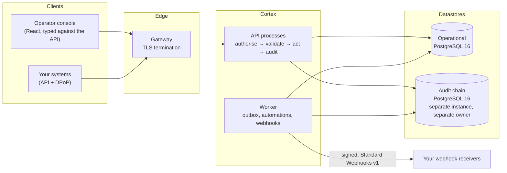

<div align="center">

# Cortex 2.0

**The sovereign operations platform for telecom operators and regulated service businesses.**

CRM, ERP, BSS and OSS in one system — run on your own hardware or your own cloud account,
inside your own network, under your own keys.

[](https://github.com/BlueRingsLabs/Cortex_v2.0.0/actions/workflows/ci.yml)
[](LICENSE)

[Architecture](docs/architecture.md) · [Benchmarks](docs/benchmarks.md) ·
[Security model](docs/security-model.md) · [Integrating](docs/integrating.md) ·
[API](api/openapi.json) · [Webhooks](api/webhooks.md) · [SDKs](sdk/) · [Examples](examples/)

</div>

---

## What Cortex is

A carrier runs on a dozen systems that each hold part of the truth: one bills, one rates usage,
one keeps the customer, one the ledger, one the stock, one the cases, and the integrations
between them are where the money goes missing. Cortex is those systems as **one platform with
one data model, one authorisation engine and one tamper-evident record of everything done in
it.**

| Area | What it covers |
| --- | --- |
| **BSS** | Product catalogue with versioned publication, subscriptions and their lifecycle, usage mediation and rating, prepaid balances with real-time authorisation, invoicing and electronic fiscal filing, dunning and collections, payments, promotions, interconnect settlement |
| **CRM** | The customer view, cases with routed queues and measured service levels, omnichannel conversations, sales, churn intelligence |
| **OSS** | Service activation, number portability, eSIM provisioning |
| **ERP** | General ledger, treasury, payables and receivables, fixed assets, serialised and counted stock (weighted average or FIFO), procurement, workforce and payroll |
| **Knowledge** | Document collections and retrieval governed by the same permissions as the data, with personal data masked before anything reaches a model |
| **Platform** | Tenancy, a capability-based authorisation engine, an append-only signed audit trail on its own datastore, automations, signed outbound webhooks, vertical presets for mobile operators, cable and fibre operators and contact centres |

Cortex is proprietary software, licensed to operators who run it themselves. **This repository
holds what anybody integrating with it needs, under Apache-2.0**: the webhook SDKs, runnable
integration examples, the public API specification and the webhook reference, together with the
architecture and the measured performance.

## What is in this repository

| Path | What | Licence |
| --- | --- | --- |
| [`sdk/`](sdk/) | Webhook verification and typed events for **Python, TypeScript and Go** — no dependencies beyond each language's standard library | Apache-2.0 |
| [`examples/`](examples/) | Webhook receivers in all three languages, exercised in CI against deliveries the platform signed | Apache-2.0 |
| [`api/openapi.json`](api/openapi.json) | The integration surface of the Cortex API: the routes an external system calls, with their shapes | Apache-2.0 |
| [`api/webhooks.md`](api/webhooks.md) | Every fact Cortex can deliver, field by field, with a JSON Schema for every body in [`api/schemas/`](api/schemas/) | Apache-2.0 |
| [`docs/`](docs/) | Architecture, security model, benchmarks, and how to integrate | Apache-2.0 |

Everything under `api/` and the SDKs' event types are generated from the platform's own code at
release, so they are the shapes Cortex actually sends — not a description of them.

## Architecture at a glance



Two datastores, by design: the audit trail is evidence only while a compromised operational
credential cannot reach it, so it lives on its own instance under its own owner, signed with a
key held outside both. More in [`docs/architecture.md`](docs/architecture.md).

## How it is built

* **It refuses rather than degrades.** A request it cannot authorise, record or complete safely
  is refused with a reason — a write the audit chain cannot record is not made.
* **Capabilities, not roles.** 198 capabilities, each with a risk tier, the archetypes allowed to
  hold it and the authentication strength it needs; roles are bundles of them, and nobody can grant
  what they do not hold.
* **Sessions are bound to a key.** Every request carries a DPoP proof signed by the client's
  private key, so a stolen access token is inert. A hardware security key raises a session to
  the highest assurance level.
* **The record cannot be rewritten.** Every mutation is appended to a hash-chained audit trail
  whose checkpoints are signed with Ed25519; the database refuses updates and deletes to it at
  the trigger level, and the application's own login cannot reach its owner.
* **Isolation is structural.** The tenant predicate is added to every query by the persistence
  layer, not by each query's author, and textual SQL is refused unless it proves its tenant.
* **Nothing leaves without leave.** Outbound traffic goes only to hosts an administrator listed,
  checked at the socket by the application and again at the node by network policy.
* **No vendor lock-in.** No third-party service in the path, no licence server to reach, no
  delegated cryptographic authority. It runs on one host, on Kubernetes on your own machines, or
  on AWS, Google Cloud or Azure.

## Measured, not claimed

On deliberately modest hardware, with every result reproducible from a single command against a
fixture of a million subjects in deliberately skewed tenants. Full methodology in
[`docs/benchmarks.md`](docs/benchmarks.md).

| What | Result |
| --- | --- |
| Every read the console makes, three tenants at once, live demonstration (4 vCPU) | **p95 under 100 ms on all 67 reads**; p99 under 100 ms on all 67 in the best run |
| A tenant-scoped read in a 900,000-subject tenant | **4 buffers**, the same as in a 5,000-subject tenant — cost independent of estate size |
| Credit authorisations from eight switches against one prepaid line | **160 granted, 0 errors**, and no credit granted twice: the check and the deduction are one statement |
| Transactions killed mid-authorisation, and retries after an ambiguous timeout | **0 violations** in 65 attempts across both |
| Month-end pipeline on production-shaped data, 128,000 records | ingest **10,649/s**, mediation **2,965/s**, the whole pipeline in **63 s** |
| Payroll at 2,000 employees | **8 reads** for the whole calculation — 3,750× fewer than before it was rebuilt |

## Integrating in five minutes

Verify a webhook — Python shown; TypeScript and Go are the same three lines:

```python
from cortex_webhooks import WebhookVerificationError, verify

def receive(request):
    try:
        event = verify(SECRET, request.headers, request.body)   # the raw body, unparsed
    except WebhookVerificationError as refused:
        return 400, refused.reason
    if event["type"] == "invoicing.invoice_issued":
        queue_invoice(event["data"]["invoice_reference"], event["data"]["total_minor"])
    return 204, ""
```

Then read [`docs/integrating.md`](docs/integrating.md) for the API: sessions bound to a key,
the error envelope and its ten categories, and the correlation id every response carries.

## Deploying Cortex

Cortex is delivered to licensees with its deployment kit: a one-command single-host installer
with daily golden restores and off-host backups, a hardened Helm chart that speaks Gateway API,
and infrastructure as code for **AWS, Google Cloud, Azure and bare metal**, each held to the same
guarantees — two private datastore instances that require TLS, survive a zone and recover to a
point in time; a cluster that enforces network policy; no database password in the
infrastructure state, which is itself encrypted. A live demonstration runs at
[cortex.gonzaloromeroai.com](https://cortex.gonzaloromeroai.com).

## Licence

The contents of this repository are licensed under the [Apache License 2.0](LICENSE). The Cortex
platform itself is proprietary and is not in this repository; see [`NOTICE`](NOTICE).

Cortex is designed, written and maintained by **Gonzalo Romero**
([@glromero](https://github.com/glromero)), its sole author.
