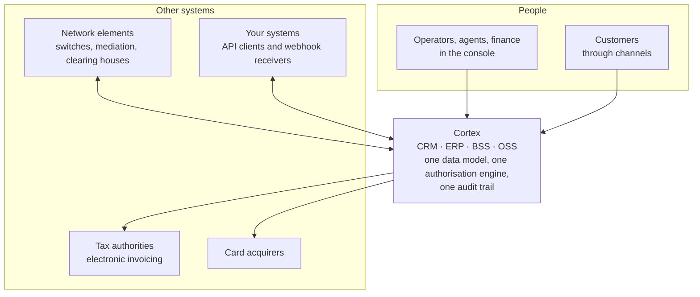
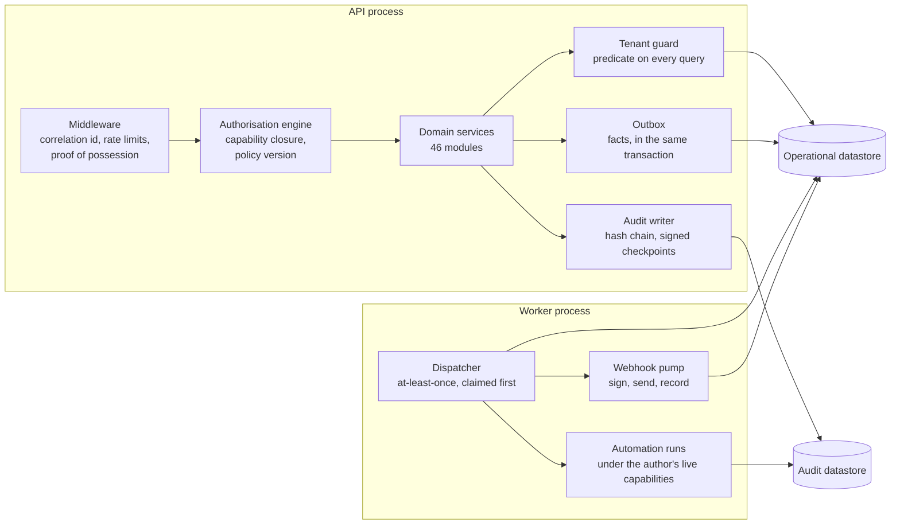
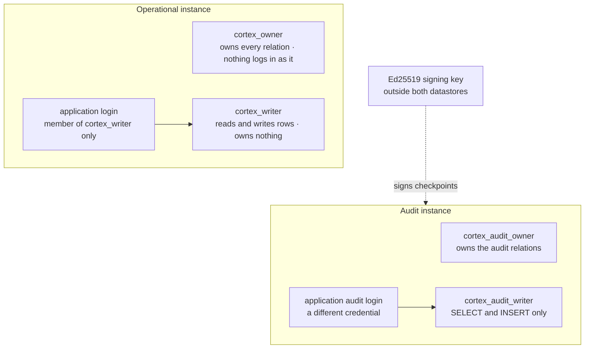
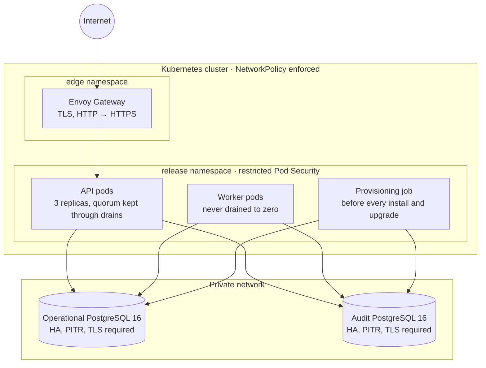

# Cortex — architecture

How Cortex is put together, and why each part is where it is. Every diagram below describes the
2.0.0 release.
Each is also rendered as a standalone SVG in [`diagrams/`](diagrams/).

---

## 1. The system and what it talks to

Every arrow out of Cortex goes only to a host an administrator listed. The application refuses
any other destination at the socket — after resolving the name and pinning the address, so a
DNS rebind cannot move it — and the network policy refuses it again at the node, where a
compromised process cannot reach.

## 2. Inside the platform

**A request** passes the middleware (its correlation id, its rate budget, its DPoP proof), the
authorisation engine (the capability, the archetype's ceiling, an explicit deny, the grant's
scope, the session's assurance level), and a domain service, whose every query the tenant guard
completes with the tenant's predicate. The service writes rows and publishes facts in one
transaction; the audit record is written before the request's unit of work commits, and a write
the audit chain cannot record is refused.

**The worker** delivers the facts. Delivery is at least once and claimed before it is attempted,
so a consumer that fails is retried rather than recorded as done; consumers deduplicate on the
message id. Automation rules run under their author's capabilities as they stand when the rule
fires, and anything a customer would see waits for a person. Webhooks are claimed under row
locks, signed, sent outside the transaction, and recorded after.

## 3. The two datastores

* **Two instances, not two databases on one.** An instance's administrator reaches every database
  on it, so a compromised operational instance must not be able to reach the evidence of what was
  done to it.
* **The application owns nothing.** A PostgreSQL table's owner can disable its triggers, and
  seventy-four triggers carry rules the data must keep — a ledger movement continues its chain,
  an invoice never changes, a paid payroll is frozen. So the tables belong to a role nothing logs
  in as, and the application is a member of a role that reads and writes rows and nothing else.
* **The audit trail is append-only at three levels**: grants that withhold UPDATE and DELETE,
  triggers that refuse them, and event triggers that refuse dropping the tables or disabling the
  triggers. Every start checks all of it as the application's own login, and production refuses
  to start when it does not hold.
* **The chain is signed.** Each record carries the hash of the one before it; checkpoints are
  signed with an Ed25519 key that lives in neither database, so whoever reaches a database still
  cannot forge a checkpoint that verifies.

## 4. Consistency, module by module

Each of the 46 modules declares what a network partition may do to its data — a PACELC class —
and the class is not documentation: it sets the module's transaction isolation and its locking.

| Class | Meaning | Modules, for example |
| --- | --- | --- |
| PC/EC | Refuse under partition; serialise always | ledger, balances, payments, invoicing, counted stock, identity, the audit trail |
| PC/EL | Refuse under partition; fast when healthy | authorisation, tenancy, the product catalogue, integrations |
| PA/EC | Stay available; order within an aggregate | cases, subscriptions, activation, dunning, automation |
| PA/EL | Stay available; eventually consistent | the customer view, omnichannel, mediation, rating, reporting, retrieval |

Money is PC/EC everywhere it moves: a credit check and its deduction are one conditional
statement, a counted-stock issue holds the balance's row lock, and a payment is idempotent on the
network's own reference.

## 5. Deployment

* **Default-deny, both directions.** The API's port is reachable from the edge namespace alone;
  egress is DNS, the datastores on 5432, and the hosts an administrator listed on 443.
* **Every security control is a literal, not a value.** Non-root, a read-only root filesystem,
  every capability dropped, no service-account token, no privilege escalation: written into the
  templates, so a `--set` on a deploy command cannot turn one off.
* **The provisioning job holds the only credential that can create roles**, and runs before the
  pods roll: roles, both migration trees as their owner roles, grants, and then the posture asked
  of the result as the application's own logins. If the application would refuse to start on what
  it produced, the release stops before any pod is replaced.
* **Migrations never stop the world.** Each runs in one transaction and waits at most five
  seconds for a lock; the previous release runs on the new schema, because every migration
  expands before it contracts.

The same contract holds on AWS (EKS, RDS), Google Cloud (GKE, Cloud SQL), Azure (AKS, flexible
servers), Kubernetes on your own machines (CloudNativePG), and a single host with Docker Compose.

---

*Gonzalo Romero — sole author.*
